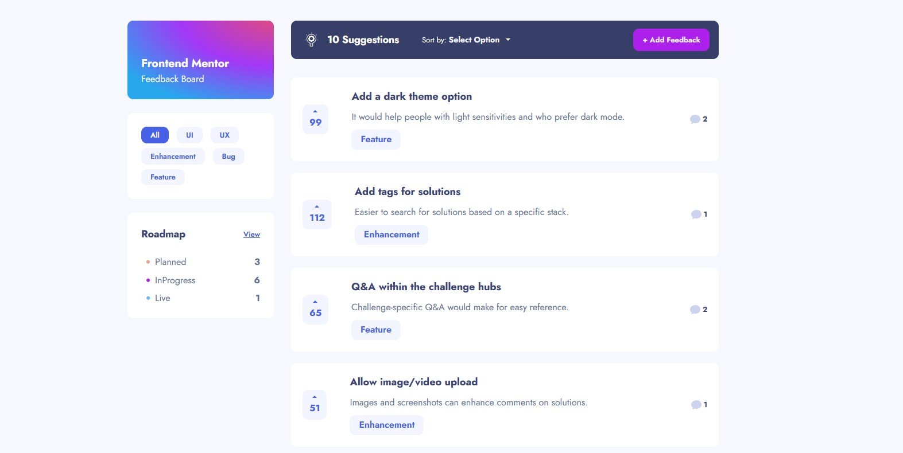

# Feedback App



## Demo

[Canlı Demo](https://feedback-board-afk-g.vercel.app/)

## Proje Tanımı

Feedback App, kullanıcıların geri bildirim bırakabilecekleri, oylamalara katılabilecekleri ve bu geri bildirimlerin durumunu takip edebilecekleri etkileşimli bir web uygulamasıdır.

## Özellikler

- Yeni geri bildirim ekleme
- Geri bildirimleri kategorilerine göre filtreleme
- Geri bildirimleri oylama
- Geri bildirimlere yorum yapma
- Geri bildirimleri düzenleme ve silme
- Geri bildirimlerin durumlarını takip etme (Planned, In-Progress, Live)
- Tamamen mobil uyumlu tasarım

## Teknolojiler

- **React**: Kullanıcı arayüzü geliştirme
- **Vite**: Hızlı geliştirme ortamı
- **React Context API**: Durum yönetimi
- **React Hot Toast**: Bildirim sistemi
- **CSS**: Özel stillendirme
- **LocalStorage**: Veri saklama

## Klasör Yapısı

```
feedback-web-app/
├── public/
│   ├── data/
│   │   └── feedback-data.json
│   └── images/
├── src/
│   ├── components/
│   │   ├── FeedbackDetail.jsx
│   │   ├── FeedbackForm.jsx
│   │   ├── Header.jsx
│   │   ├── Roadmap.jsx
│   │   └── Suggestions.jsx
│   ├── css/
│   ├── App.jsx
│   ├── helper.jsx
│   ├── main.jsx
│   └── reset.css
├── package.json
└── vite.config.js
```

## Kurulum ve Çalıştırma

Projeyi yerel ortamınızda çalıştırmak için aşağıdaki adımları izleyin:

```bash
# Projeyi klonlayın
git clone https://github.com/acunmedyaakademi/kamp-feedbackApp-AFK-G

# Proje dizinine gidin
cd feedback-web-app

# Bağımlılıkları yükleyin
npm install

# Geliştirme sunucusunu başlatın
npm run dev
```

## Kullanım

Uygulama başladığında, ana sayfa üzerinde mevcut geri bildirimleri görebilirsiniz. Yeni bir geri bildirim eklemek için "Add Feedback" butonuna tıklayabilirsiniz. Geri bildirimleri filtrelemek için kategori seçeneklerini kullanabilirsiniz. Herhangi bir geri bildirimin detaylarını görmek ve yorum eklemek için üzerine tıklayabilirsiniz.
